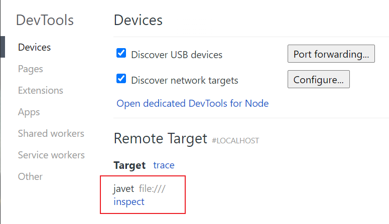
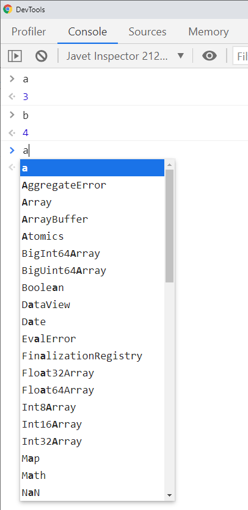

=================================
Debug with Chrome Developer Tools
=================================

`Chrome DevTools <https://developers.google.com/web/tools/chrome-devtools>`_ (aka. CDT) is a set of web developer tools built directly into the Google Chrome browser. DevTools can help you edit pages on-the-fly and diagnose problems quickly, which ultimately helps you build better websites, faster.

CDT Shell
=========

Javet ships a demo :extsource2:`CDT Shell <../../src/test/java/com/caoccao/javet/tutorial/cdt/TestCDT.java>` application to demonstrate how to work with CDT to perform a live debugging.

1. Run CDT Shell
----------------

Run CDT Shell as a normal Java console application and an interactive console will appear working just like a node console does.

2. Run Script in CDT Shell
--------------------------

Run arbitrary code in the console just like what can be done in a node console.

.. code-block:: js

    > let a = 3
    undefined
    > let b = 4
    undefined
    > a + b
    7

3. Open CDT
-----------

Open `chrome://inspect/ <chrome://inspect/>`_ in Chrome, wait a few seconds and Javet will appear as a remote target.

4. Debug as Usual
-----------------

Click ``inspect``. Voilà, DevTools is up. As the screenshot shows, live evaluation and auto-completion work successfully. Enjoy the live debugging.

Chrome Developer Tools Internals
================================

Handshake
---------

* CDT Shell listens to port 9229 by default because CDT constantly queries http://127.0.0.1:9229/json/list for a list of remote targets. CDT Shell tells CDT that it is a node flavored remote target via http://127.0.0.1:9229/json/list and the websocket address is ``ws://127.0.0.1:9229/javet``.
* CDT queries http://127.0.0.1:9229/json/version for protocol version. CDT Shell currently uses v1.3. The complete protocol API docs are available at https://chromedevtools.github.io/devtools-protocol/. 
* CDT queries http://127.0.0.1:9229/javet/list with a websocket upgrade request. CDT Shell responses with websocket upgrade accepted.
* CDT switches to ``ws://127.0.0.1:9229/javet`` and sends the following 8 messages to perform a handshake with a node flavored remote target.

.. code-block:: js

    Chrome: {"id":1,"method":"Runtime.enable","params":{}}
    Javet Notification: {"method":"Runtime.executionContextCreated","params":{"context":{"id":1,"origin":"","name":"Javet Inspector 00000000","uniqueId":"00000000.00000000"}}}
    Javet Response: {"id":1,"result":{}}
    Chrome: {"id":2,"method":"Debugger.enable","params":{"maxScriptsCacheSize":100000000}}
    Javet Response: {"id":2,"result":{"debuggerId":"00000000.00000000"}}
    Chrome: {"id":3,"method":"Debugger.setPauseOnExceptions","params":{"state":"none"}}
    Javet Response: {"id":3,"result":{}}
    Chrome: {"id":4,"method":"Debugger.setAsyncCallStackDepth","params":{"maxDepth":32}}
    Javet Response: {"id":4,"result":{}}
    Chrome: {"id":5,"method":"Profiler.enable","params":{}}
    Javet Response: {"id":5,"result":{}}
    Chrome: {"id":6,"method":"Runtime.getIsolateId","params":{}}
    Javet Response: {"id":6,"result":{"id":"00000000"}}
    Chrome: {"id":7,"method":"Debugger.setBlackboxPatterns","params":{"patterns":[]}}
    Javet Response: {"id":7,"result":{}}
    Chrome: {"id":8,"method":"Runtime.runIfWaitingForDebugger","params":{}}
    Javet Response: {"id":8,"result":{}}

.. note::

    Method ``Runtime.runIfWaitingForDebugger`` can be regarded as the handshake completion and there is no need to parse this message because it is exposed as a callback in ``IV8InspectorListener``.

Actually, inside V8, the first message can enable the debugging without the rest of them. Please refer to the :extsource2:`source code <../../src/test/java/com/caoccao/javet/interop/TestV8Inspector.java>` for details.

Customization
=============

Yes, please feel free to customize the debugging server in your environment. CDT Shell is created as a showcase for further customization. Here are some tips.

* Integrate with your HTTP and WebSocket servers. CDT Shell currently uses embedded Jetty. Be careful, HTTP and WebSocket servers need to be hosted together, otherwise, CDT refuses to communicate with the WebSocket server.
* Add your ``IV8InspectorListener`` to intercept all the event messages. In practice, a decent JSON library like JackSon, GSon may help interpret those messages. As a demo, CDT Shell doesn't process those messages. Why intercept those messages? Because:

    * To set up breakpoints before script is executed.
    * To send messages to CDT right after CDT is connected.
    * To turn on / off certain features.
    * To enforce authentication and authorization.
    * To switch among V8 runtimes.

FAQs
====

Does it Support Node.js Mode?
-----------------------------

Yes, Javet V8 inspector supports the Node.js Mode as well as the V8 mode though the built-in Node.js inspector is disabled because of some other issues. Please visit :doc:`../faq/development/why_is_the_inspector_disabled_in_node_js_mode` for more details.

Is There a Live Demo?
---------------------

Yes, `JavetShell <https://github.com/caoccao/JavetShell>`_ provides a live demo via either a jar file or a docker image.
