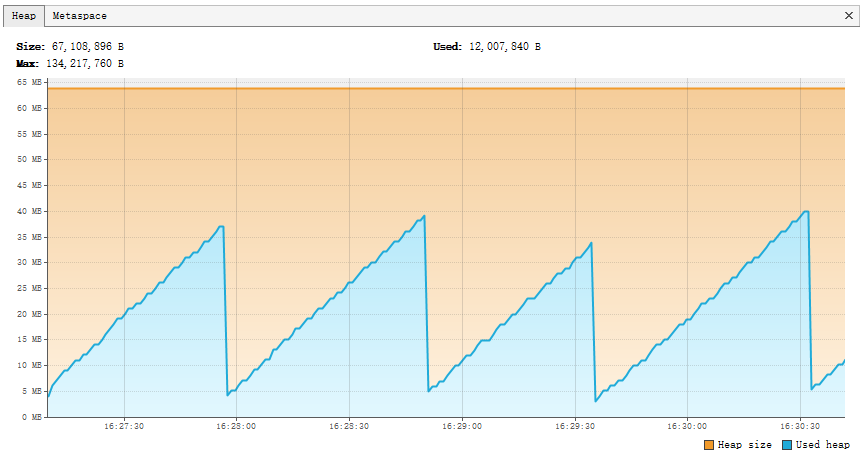

=================
Memory Management
=================

3 Challenges in Memory Management
=================================

JVM GC
------

JVM is known to have a GC that manages memory automatically. However, that doesn't cover the objects in JNI native implementation. Once ``NewGlobalRef(javaObject)`` is called, that ``javaObject`` lives forever in JVM until ``DeleteGlobalRef(javaObject)`` is called.

C++ Runtime
-----------

Smart pointers in C++ cannot easily work across JNI to JVM, in other words, raw pointers are directly referenced in JVM as ``long``. C++ runtime has no idea when to free the memory of those raw pointers unless JVM tells C++ runtime to release via JNI.

V8 GC
-----

V8 generally categorizes objects in memory to 3 types.

1. ``v8::Local`` - It lives within the local scope of a C++ function call.
2. ``v8::Persistent`` - Its lifecycle is managed by V8 GC.
3. ``v8::External`` - V8 GC treats it as root object so that it lives as long as the V8 isolate lives.

The awful thing in V8 GC is V8 does not make final callback when a context is being closed. From V8 perspective, that's a performance improvement. But from Javet perspective, Javet cannot completely rely on V8 to do the resource management. So, Javet keeps track of all unmanaged resource and makes sure there is no memory leak in all cases.

Recommended Options
===================

Javet directly borrows the way V8 manages objects in JVM. The rule is simple in the following 2 Options.

Automatic Management with ``try-with-resource``
-----------------------------------------------

.. code-block:: java

    // Create an object and wrap it with try resource.
    try (V8ValueObject v8ValueObject = v8Runtime.createV8ValueObject()) {
        // Do whatever you want to do with this object
        // v8ValueObject.close() is called automatically at the end of the block.
    }
    // Outside the code block, this object is no longer valid.

Automatically Manage with Weak Reference
----------------------------------------

.. code-block:: java

    // Create an object.
    V8ValueObject v8ValueObject = v8Runtime.createV8ValueObject();
    // Do whatever you want to do with this object
    v8ValueObject.setWeak();
    // Do whatever you want to do with this object
    /*
     v8ValueObject.close() is called automatically via V8 GC callback.
     So, there is no need to close the V8 object explicitly.
     This is quite useful when the lifecycle is not determined, E.g. V8 function.
     */

Note: V8 does not recycle objects that are referenced by other objects. Please make sure the object chain is broken so that GC can work as expected. ``com.caoccao.javet.interception.logging.JavetStandardConsoleInterceptor`` is a good sample showing how to deal with that.

Alternative Option: ArrayBuffer
===============================

The ArrayBuffer object is used to represent a generic, fixed-length raw binary data buffer.

It is an array of bytes, often referred to in other languages as a "byte array".You cannot directly manipulate the contents of an ArrayBuffer; instead, you create one of the typed array objects or a DataView object which represents the buffer in a specific format, and use that to read and write the contents of the buffer.

Javet offers complete support to all the typed arrays as well as ``DataView`` as following. There is a ``java.nio.ByteBuffer`` inside every typed array and ``DataView``. That ``ByteBuffer`` directly links to the corresponding backing store of V8 typed array. In other words, Javet and V8 can both access the same address to achieve zero memory copy. Please consider using typed array in performance sensitive scenarios.

+-------------------+-----------------------------+---------------+------------------------------------------------------------------------------------+---------------------+-------------------------------+
|        Type       |         Value Range         | Size in bytes |                                     Description                                    |     Web IDL type    |       Equivalent C type       |
+===================+=============================+===============+====================================================================================+=====================+===============================+
| Int8Array         | -128 to 127                 | 1             | 8-bit two's complement signed   integer                                            | byte                | int8_t                        |
+-------------------+-----------------------------+---------------+------------------------------------------------------------------------------------+---------------------+-------------------------------+
| Uint8Array        | 0 to 255                    | 1             | 8-bit unsigned integer                                                             | octet               | uint8_t                       |
+-------------------+-----------------------------+---------------+------------------------------------------------------------------------------------+---------------------+-------------------------------+
| Uint8ClampedArray | 0 to 255                    | 1             | 8-bit unsigned integer (clamped)                                                   | octet               | uint8_t                       |
+-------------------+-----------------------------+---------------+------------------------------------------------------------------------------------+---------------------+-------------------------------+
| Int16Array        | -32768 to 32767             | 2             | 16-bit two's complement signed   integer                                           | short               | int16_t                       |
+-------------------+-----------------------------+---------------+------------------------------------------------------------------------------------+---------------------+-------------------------------+
| Uint16Array       | 0 to 65535                  | 2             | 16-bit unsigned integer                                                            | unsigned short      | uint16_t                      |
+-------------------+-----------------------------+---------------+------------------------------------------------------------------------------------+---------------------+-------------------------------+
| Int32Array        | -2147483648   to 2147483647 | 4             | 32-bit two's complement signed   integer                                           | long                | int32_t                       |
+-------------------+-----------------------------+---------------+------------------------------------------------------------------------------------+---------------------+-------------------------------+
| Uint32Array       | 0 to 4294967295             | 4             | 32-bit unsigned integer                                                            | unsigned long       | uint32_t                      |
+-------------------+-----------------------------+---------------+------------------------------------------------------------------------------------+---------------------+-------------------------------+
| Float32Array      | 1.2×10-38 to 3.4×1038       | 4             | 32-bit IEEE floating point   number (7 significant digits e.g., 1.234567)          | unrestricted float  | float                         |
+-------------------+-----------------------------+---------------+------------------------------------------------------------------------------------+---------------------+-------------------------------+
| Float64Array      | 5.0×10-324 to 1.8×10308     | 8             | 64-bit IEEE floating point   number (16 significant digits e.g., 1.23456789012345) | unrestricted double | double                        |
+-------------------+-----------------------------+---------------+------------------------------------------------------------------------------------+---------------------+-------------------------------+
| BigInt64Array     | -263 to 263-1               | 8             | 64-bit two's complement signed   integer                                           | bigint              | int64_t (signed long long)    |
+-------------------+-----------------------------+---------------+------------------------------------------------------------------------------------+---------------------+-------------------------------+
| BigUint64Array    | 0 to 264-1                  | 8             | 64-bit unsigned integer                                                            | bigint              | uint64_t (unsigned long long) |
+-------------------+-----------------------------+---------------+------------------------------------------------------------------------------------+---------------------+-------------------------------+

Please refer to `TestV8ValueTypedArray <../../src/test/java/com/caoccao/javet/values/reference/TestV8ValueTypedArray.java>`_ and `TestV8ValueDataView <../../src/test/java/com/caoccao/javet/values/reference/TestV8ValueDataView.java>`_ for sample code snippets.

GC
==

Automatic GC
------------

Javet has built-in automatic GC in both Node.js mode and V8 mode. Why? In high frequency API calling area, V8 may not keep up with the GC pace that JVM performs. Sometimes, JVM is running out of heap memory whereas V8 holds many zombie objects that are referenced by Javet in JVM. In this case, JVM ignores those objects unless V8 releases them in V8 GC cycle.

Passive GC
^^^^^^^^^^

So, how to notify V8 GC that Java heap memory pool is running out of space? Javet automates this via ``V8Host`` and ``V8Notifier``. By default, this feature is disabled. Here is the step-by-step on how to enable this feature.

1. (Optional) Call ``V8Host.setMemoryUsageThresholdRatio(double)`` to set memory usage threshold ratio. This is optional because the default value is 0.7.
2. Call ``V8Host.getNodeInstance().enableGCNotification()`` or ``V8Host.getV8Instance().enableGCNotification()`` to enable the notification.

Here is a sample heap memory usage with default memory usage threshold ration and ``-Xms64m -Xmx64m``. Please note that in this sample, application is under high pressure of creating and destroying V8 objects. In normal cases, the curve is much smoother.

What happens internally is as following.

1. ``V8Notifier`` listens to the heap memory notification from JVM per ``V8Host`` instance.
2. JVM notifies ``V8Notifier`` that memory threshold exceeds.
3. ``V8Notifier`` broadcasts GC scheduled flag to all ``V8Runtime`` managed by the ``V8Host`` instance.
4. Each ``V8Runtime`` performs GC in its own isolate.

Aggressive GC
^^^^^^^^^^^^^

Just get ``V8Runtime`` from Javet engine pool that aggressively sends GC notification to idle engine in daemon thread. There is no performance overhead because:

* The engine performs GC when it is idle in a dedicated thread.
* Javet engine pool is lock free so that the GC doesn't affect other worker threads.

Of course, this behavior can be turned off by calling ``JavetEngineConfig.setAutoSendGCNotification(false)``.

Manual GC
---------

There are 3 ways of manually triggering GC in both Node.js mode and V8 mode.

``V8Runtime.await()``
^^^^^^^^^^^^^^^^^^^^^

This API represents a light-weighted way of giving V8 a hint to perform GC. It actually tells Node.js or V8 runtime to drain the message or task queue. As a side effect of the drain, a GC may occur based on the decision of Node.js or V8 runtime.

``V8Runtime.idleNotificationDeadline(long deadlineInMillis)``
^^^^^^^^^^^^^^^^^^^^^^^^^^^^^^^^^^^^^^^^^^^^^^^^^^^^^^^^^^^^^

This API explicitly tells Node.js or V8 runtime that the application expects a GC to happen in the given milliseconds. Be careful, Node.js or V8 runtime may disregard this instruction.

``V8Runtime.lowMemoryNotification()``
^^^^^^^^^^^^^^^^^^^^^^^^^^^^^^^^^^^^^

This API explicitly tells Node.js or V8 runtime to perform a GC immediately. It is also used in automatic GC aforementioned.
