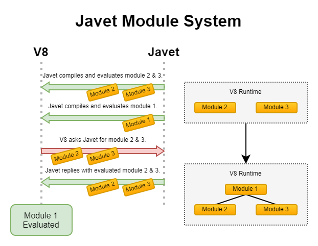

==============
Modularization
==============

Node.js Mode
============

Example
-------

In Node.js mode, Javet leaves Node.js with its own ways of handling modules. The coding experience is identical to the one in Node.js and applications can get all features supported by Javet, like function interception. Here is an example.

.. code-block:: java

    try (JavetEnginePool<NodeRuntime> javetEnginePool = new JavetEnginePool<NodeRuntime>()) {
        javetEnginePool.getConfig().setJSRuntimeType(JSRuntimeType.Node);
        try (IJavetEngine<NodeRuntime> iJavetEngine = javetEnginePool.getEngine()) {
            NodeRuntime nodeRuntime = iJavetEngine.getV8Runtime();
            File workingDirectory = new File(JavetOSUtils.WORKING_DIRECTORY, "scripts/node/test-node");
            // Set the require root directory so that Node.js is able to locate node_modules.
            nodeRuntime.getNodeModule(NodeModuleModule.class).setRequireRootDirectory(workingDirectory);
            getLogger().logInfo("1.23 + 2.34 = {0}", nodeRuntime.getExecutor(
                    "const Decimal = require('decimal.js');" +
                            "const a = new Decimal(1.23);" +
                            "const b = new Decimal(2.34);" +
                            "a.add(b).toString();").executeString());
        }
    }

Gaps between Javet Node.js Mode and Native Node.js
--------------------------------------------------

=================== ======================================= ==============================================
Feature             Javet Node.js Mode                      Native Node.js
=================== ======================================= ==============================================
``require()`` Root  Java Application Working Directory      JavaScript Application Working Directory
Working Directory   Java Application Working Directory      JavaScript Application Working Directory
``__dirname``       N/A                                     Yes
``__filename``      N/A                                     Yes
Module Mode         default: false                          default: true
=================== ======================================= ==============================================

Usually the Java application working directory doesn't contain ``node_modules``. That for sure breaks Node.js. No worry, here are the steps on closing the gaps.

1. Set the ``require()`` root directory so that Node.js is able to locate ``node_modules``.
2. Set working directory to where the script is located.
3. Set ``__dirname``.
4. Set ``__filename``.

Luckily, in Javet, when ``getExecutor(File scriptFile)`` or ``getExecutor(Path scriptPath)`` is called, all these 4 steps are automatically performed. If ``getExecutor(String scriptString)`` is called, obviously Javet doesn't know what to do, but application may call ``IV8Executor.setResourceName(String resourceName)`` later to perform these 4 steps. So, Javet Node.js mode doesn't care where the script comes from. Application may feel free to virtualize Node.js.

Can Javet run script in Node.js Module Mode? Yes, just call ``IV8Executor.setModule(true)``.

The exciting thing is: in Javet, applications may have multiple instances of Node.js pointing to different ``node_modules`` and potentially these Node.js instances can share the same piece of data.

Deal with Native Modules
------------------------

Node.js native modules usually cannot be dynamically loaded to Javet. E.g. sqlite3. That issue also bothers Electron. Electron folks created project `electron-rebuild <https://github.com/electron/electron-rebuild>`_ which rebuilds the native modules from source code and its own native symbols.

Javet follows the same approach on Windows, and a simpler approach on Linux.

Patch ELF Native Modules on Linux
^^^^^^^^^^^^^^^^^^^^^^^^^^^^^^^^^

The native modules on Linux don't know the existence of Javet. When they look up Node.js symbols which are provided by Javet, they just fail with errors like the following.

    com.caoccao.javet.exceptions.JavetExecutionException: Error: /....../node_modules/sqlite3/lib/binding/napi-v3-linux-x64/node_sqlite3.node: undefined symbol: napi_create_error

The fix is very simple. Here is a sample sqlite3.

.. code-block:: shell

    # Install patchelf on Ubuntu (Optional)
    sudo apt install patchelf
    cd scripts/node
    # Install sqlite3
    npm install
    cd javet-rebuild
    export NODE_MODULE_FILE="../node_modules/sqlite3/lib/binding/napi-v3-linux-x64/node_sqlite3.node"
    ./rebuild.sh

The :extsource3:`rebuild.sh <../../../scripts/node/javet-rebuild/rebuild.sh>` actually calls `patchelf <https://github.com/NixOS/patchelf>`_ to add Javet to the node module's dependency.

Rebuild Native Modules on Windows
^^^^^^^^^^^^^^^^^^^^^^^^^^^^^^^^^

The native modules on Windows don't know the existence of Javet. Windows dynamic library loading API ``LoadLibraryExW`` throws the following error.

    A dynamic link library (DLL) initialization routine failed.

The fix is a bit complicated.

* Prepare the Windows build environment by following :doc:`../../development/build`.
* Install the node modules from source code ``npm install --build-from-source``.
* Download the corresponding Javet library file from this `drive <https://drive.google.com/drive/folders/18wcF8c-zjZg9iZeGfNSL8-bxqJwDZVEL?usp=sharing>`_.
* Unzip the Javet library file somewhere.
* Create a rebuild script pointing to the Javet library file by referencing :extsource3:`rebuild-sqlite3.cmd <../../../scripts/node/javet-rebuild/rebuild-sqlite3.cmd>` and :extsource3:`rebuild.cmd <../../scripts/node/javet-rebuild/rebuild.cmd>`.
* Run the rebuild script.

The rebuild script actually replaces ``node.lib`` with ``libjavet....lib`` during the rebuild so that the new node modules can tell ``LoadLibraryExW`` to look for Javet instead of Node.js.

Javet calls for someone who can voluntarily host the Javet libraries and Javet compatible node modules so that major Javet users don't need to go through these. For now, it has to be a pretty manual work.

.. caution:: Make Backups

    Once the node modules are patched or rebuilt, they can only be loaded by that particular version of Javet and they cannot be loaded by Node.js any more.

Before the rebuild script is executed, the imports look like the following:

.. code-block:: text

    dumpbin /imports node_modules\sqlite3\lib\binding\napi-v3-win32-x64\node_sqlite3.node

    Section contains the following delay load imports:

    node.exe
              00000001 Characteristics
      0000000180154A40 Address of HMODULE
      0000000180154818 Import Address Table
      000000018014F248 Import Name Table
      000000018014FA68 Bound Import Name Table
      0000000000000000 Unload Import Name Table
                     0 time date stamp

                                    0000000180108724  424B napi_create_function
                                    ...
                                    0000000180108AB5  4243 napi_create_buffer_copy

After the rebuild script is executed, the imports look like the following:

.. code-block:: text

    dumpbin /imports node_modules\sqlite3\lib\binding\napi-v3-win32-x64\node_sqlite3.node

    Section contains the following delay load imports:

    libjavet-node-windows-x86_64.v.x.x.x.dll
             1801363D8 Import Address Table
             180166610 Import Name Table
                     0 time date stamp
                     0 Index of first forwarder reference

                        6096 napi_open_escapable_handle_scope
                        ...
                        6072 napi_get_undefined

Manual Patch Native Modules on Windows
^^^^^^^^^^^^^^^^^^^^^^^^^^^^^^^^^^^^^^

Apart from rebuilding the native modules on Windows, there is also a manual way of patching the native modules. Let's see how to patch ``@swc/core`` which doesn't support ``node-gyp``.

1. Download `PPEE (Puppy, Professional PE file Explorer) <https://www.mzrst.com/>`_.
2. Install SWC via ``npm i @swc/cli @swc/core``.
3. Drag and drop ``node_modules\@swc\core-win32-x64-msvc\swc.win32-x64-msvc.node`` to PPEE.
4. Navigate to ``DIRECTORY_ENTRY_DELAY_IMPORT``.
5. Change the DLL name from ``node.exe`` to ``libjavet-node-windows-x86_64.v.x.x.x.dll`` where ``x.x.x`` needs to be replaced with the actual Javet version.
6. Save the change.

Dynamically Import Built-in Modules
-----------------------------------

The Node.js module resolution callback doesn't allow the embedder to relay the calls as a default callback. If the embedder sets its own callback, the Node.js built-in modules will not be reachable any more.

There is workaround: create a new module that calls `require` internally by registering `JavetBuiltInModuleResolver` as the module resolver.

.. code-block:: java

    v8Runtime.setV8ModuleResolver(new JavetBuiltInModuleResolver());
    v8Runtime.getExecutor(
                    "import * as fs from 'node:fs';\n" +
                            "globalThis.a = fs.existsSync('/path-not-found');")
            .setModule(true).executeVoid();
    assertFalse(v8Runtime.getGlobalObject().getBoolean("a"));

The application may extend the capability of `JavetBuiltInModuleResolver` to gain granular control over the built-in modules.

V8 Mode
=======

In V8 mode, there is no out-of-box support to ES6 dynamic import. But, Javet provides complete support on top of V8. There are 2 ways of playing around with the ES6 dynamic import: Pre-load and On-demand.

Pre-load
--------

Javet stores compiled modules in a map with key = module path, value = compiled module. When V8 meets a new module to be imported, Javet will look up the map and return the compiled module to V8. So, in order to simulate dynamic import, application needs to compile those required modules before the final execution.

For instance: The dependency is as following.

.. code-block::

    Application
    ├─A
    │ ├─a.js (depends on b.js)
    │ └─B
    │   └─b.js
    ├─C
    │ └─c.js
    └─d.js

The execution steps are as following.

1. Compile module ./A/B/b.js
2. Compile module ./A/a.js
3. Compile module ./C/c.js
4. Compile module ./d.js
5. Launch the application

Here is an example. Assuming ``test.js`` depends on ``module.js``, the code looks like the following.

.. code-block:: java

    String codeString = "export function testFromModule() { return { a: 1 }; };";
    // Step 1: Assign a resource name to a piece of code.
    IV8Executor iV8Executor = v8Runtime.getExecutor(codeString).setResourceName("./module.js");
    // Step 2: Compile the module.js.
    try (V8Module v8Module = iV8Executor.compileModule()) {
        // Step 3: Evaluate the module.js.
        v8Module.executeVoid();
        if (v8Runtime.containsModule("./module.js")) {
            System.out.println("./module.js is registered as a module.");
        }
        codeString = "import { testFromModule } from './module.js'; testFromModule();";
        // Step 4: Do the same to test.js.
        iV8Executor = v8Runtime.getExecutor(codeString).setResourceName("./test.js").setModule(true);
        // Step 5: Compile and evaluate test.js and Javet will automatically feed V8 with module.js.
        try (V8ValueObject v8ValueObject = iV8Executor.execute()) {
            // Step 6: Verify the module.js taking effect.
            System.out.println("Variable a = " + v8ValueObject.getInteger("a") + ".");
        }
    }

On-demand
---------

Obviously, pre-loading modules requires application to analyze the code for complete dependency. That is too heavy in most of the cases. Luckily, Javet also supports registering a module resolver which is called back when the modules are being imported. With the module resolver, application doesn't need to analyze the code for dependency. Of course, application is responsible for security check.

Here is an example. Assuming ``test.js`` depends on ``module.js``, the code looks like the following.

.. code-block:: java

    // Step 1: Create a V8 runtime from V8 host in try-with-resource.
    try (V8Runtime v8Runtime = V8Host.getV8Instance().createV8Runtime()) {
        // Step 2: Register a custom module resolver.
        v8Runtime.setV8ModuleResolver((runtime, resourceName, v8ModuleReferrer) -> {
            // Step 3: Compile module.js from source code if the resource name matches.
            if ("./module.js".equals(resourceName)) {
                return runtime.getExecutor("export function test() { return 1; }")
                        .setResourceName(resourceName).compileV8Module();
            } else {
                return null;
            }
        });
        // Step 4: Import module.js in test.js and expose test() in global context.
        v8Runtime.getExecutor("import { test } from './module.js'; globalThis.test = test;")
                .setModule(true).setResourceName("./test.js").executeVoid();
        // Step 5: Call test() in global context.
        System.out.println("test() -> " + v8Runtime.getExecutor("test()").executeInteger());
    }

It is V8 that performs the dependency analysis. Javet just relays the callback to application and actively caches the compiled modules so that the module resolver is only called one time per module.

Synthetic Module
================

A synthetic module in V8 is a module that is created by the V8 JavaScript engine at runtime. Synthetic modules are typically used to implement new features in JavaScript, such as the module proposal for JSON imports.

Synthetic modules have a number of advantages over traditional JavaScript modules. First, they can be created and evaluated at runtime, which allows for more flexibility and dynamism. Second, synthetic modules can be isolated from the rest of the code, which makes them more secure.

Synthetic modules are implemented in V8 using a special type of module called a "Module Record". Module Records are responsible for managing the exports and imports of a module. When a synthetic module is evaluated, V8 creates a new Module Record for the module. This Module Record is then used to resolve imports and exports.

The following code snippet shows how to create and import a synthetic module.

.. code-block:: java

    v8Runtime.setV8ModuleResolver((v8Runtime, resourceName, v8ModuleReferrer) -> {
        try (V8ValueObject v8ValueObject = v8Runtime.createV8ValueObject()) {
            v8ValueObject.set("a", 1);
            try (V8ValueFunction v8ValueFunction = v8Runtime.createV8ValueFunction("(x) => x + 1")) {
                v8ValueObject.set("b", v8ValueFunction);
            }
            V8Module v8Module = v8Runtime.createV8Module("test.js", v8ValueObject);
            assertFalse(v8Module.isSourceTextModule());
            assertTrue(v8Module.isSyntheticModule());
            return v8Module;
        }
    });
    v8Runtime.getExecutor("import { a, b } from 'test.js';\n" +
                    "globalThis.a = a;\n" +
                    "globalThis.b = b;\n")
            .setModule(true).executeVoid();
    assertEquals(1, v8Runtime.getGlobalObject().getInteger("a"));
    assertEquals(2, v8Runtime.getGlobalObject().invokeInteger("b", 1));

Internals
=========

How Javet and V8 work internally for supporting modules can be found at :doc:`../../development/design`.

Please note that the way Javet handles dynamic import in V8 mode can be applied to Node.js mode. That means all Node.js modules can be virtualized by Javet.
