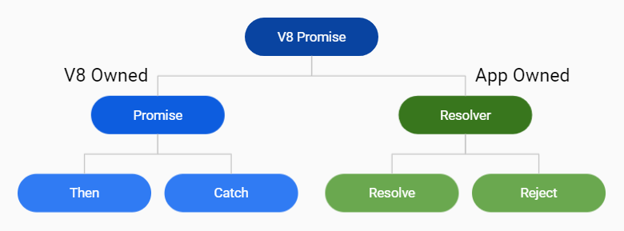
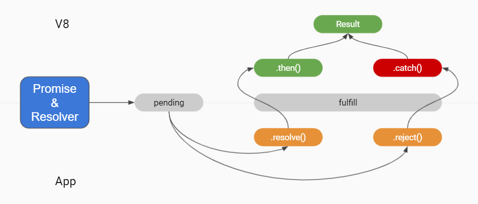

==========
V8 Promise
==========

V8 promise is an advanced topic because it's usually hard to be mastered due to its multi-threaded nature. Javet enables applications to play with V8 promise in a decent way.

Promise and Resolver
====================

Resolver is a new concept to some JavaScript developers. In fact, it is already an old friend. Inside ``new Promise((resolve, reject) => {});``, ``(resolve, reject)`` is called resolver in V8. Javet exposes the V8 promise and resolver via the same interface ``IV8ValuePromise`` because in V8 they really are the same. So, they both share the same set of API. But the ownership of the API makes the difference as the following chart shows.

Lifecycle
=========

The lifecycle is as the following chart shows.

1. JavaScript application calls an API for certain resource. E.g. ``readFileAsync``.
2. Java application receives a callback from V8 for the resource.
3. Java application creates a V8 promise resolver and holds the resolver.
4. Java application gets a V8 promise from the resolver and returns that V8 promise as callback return.
5. JavaScript application gets that promise and binds the ``.then()`` and ``.catch()``.
6. Java application fetches the resource and calls the resolver via ``.resolve()``.
7. JavaScript application receives the resource in ``.then()`` and processes the result.

Example fs.readFileAsync()
==========================

Requirements: Create a JavaScript API ``fs.readFileAsync()`` for reading a file in async manner.

The pseudo code is as following.

.. code-block:: java

    // Java application injects an interceptor as 'fs'.
    v8Runtime.getGlobalObject().set("fs", fs);

.. code-block:: javascript

    // JavaScript application calls 'readFileAsync()' and registers 'then()'
    fs.readFileAsync('a.log').then(fileContent => console.log(fileContent));

.. code-block:: java

    // Java application creates a resolver, pushes the resolver to task queue, returns a promise from the resolver.
    @V8Function
    public V8ValuePromise readFileAsync(String filePath) throws JavetException {
        V8ValuePromise v8ValuePromiseResolver = v8Runtime.createV8ValuePromise();
        queue.add(new Task(v8ValuePromiseResolver, filePath, timeout));
        return v8ValuePromiseResolver.getPromise();
    }

.. code-block:: java

    // Java application fetches the file content and resolve/reject the promise in a background thread.
    String fileContent = getFileContent(task.getFilePath());
    try (V8ValuePromise promise = task.getPromise()) {
        if (fileContent == null) {
            promise.reject(v8Runtime.createV8ValueUndefined());
        } else {
            promise.resolve(fileContent);
        }
    }
    // JavaScript application prints the file content in console afterwards.

Notes
-----

* Java application needs to have background thread(s) process async calls from V8.
* Node.js mode has its own event loop. So, sometimes, Java application has to call ``await()`` after ``resolve()`` or ``reject()``.

Unhandled Rejection
===================

Sometimes Java application breaks when unhandled rejection is raised.

In V8 mode, ``V8Runtime.setPromiseRejectCallback()`` allows Java application to register a callback implementing ``IJavetPromiseRejectCallback``.

In Node.js mode, event ``unhandledRejection`` is recommended to be listened.

.. code-block:: javascript

    import process from 'process';

    process.on('unhandledRejection', (reason, promise) => {
        console.log('Unhandled Rejection at:', promise, 'reason:', reason);
        // Application specific logging, throwing an error, or other logic here
    });

Be careful, the ``V8Runtime.setPromiseRejectCallback()`` in V8 mode also works in Node.js mode and it can disable the built-in Node.js event ``unhandledRejection``. Sometimes, this is a handy feature.

Please review the :extsource3:`test cases <../../../src/test/java/com/caoccao/javet/values/reference/TestV8ValuePromise.java>` for more detail.
