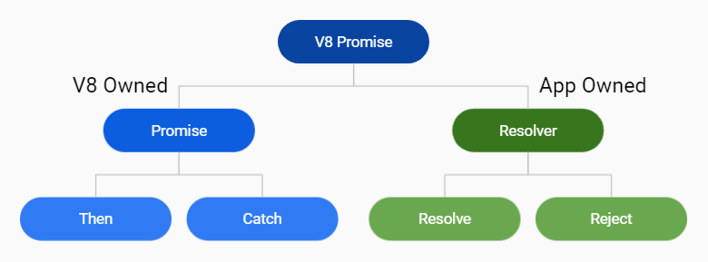
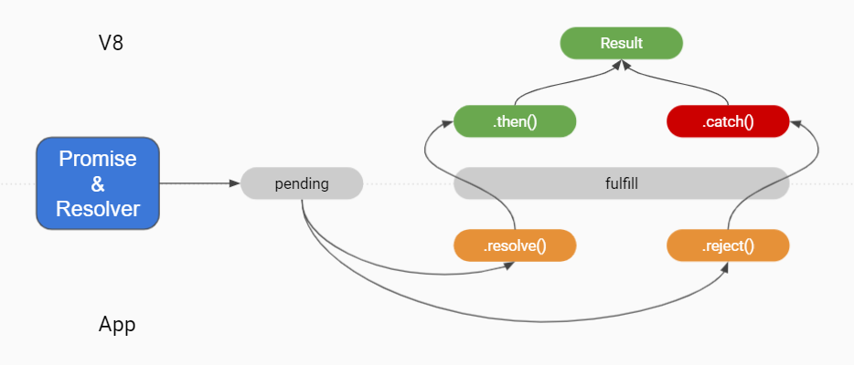

==========
V8 Promise
==========

V8 promise is an advanced topic because it's usually hard to be mastered due to its multi-threaded nature. Javet enables applications to play with V8 promise in a decent way.

Promise and Resolver
====================

Resolver is a new concept to some JavaScript developers. In fact, it is already an old friend. Inside ``new Promise((resolve, reject) => {});``, ``(resolve, reject)`` is called resolver in V8. Javet exposes the V8 promise and resolver via the same interface ``IV8ValuePromise`` because in V8 they really are the same. So, they both share the same set of API. But the ownership of the API makes the difference as the following chart shows.

Lifecycle
=========

The lifecycle is as the following chart shows.

1. JavaScript application calls an API for certain resource. E.g. ``readFileAsync``.
2. Java application receives a callback from V8 for the resource.
3. Java application creates a V8 promise resolver and holds the resolver.
4. Java application gets a V8 promise from the resolver and returns that V8 promise as callback return.
5. JavaScript application gets that promise and binds the ``.then()`` and ``.catch()``.
6. Java application fetches the resource and calls the resolver via ``.resolve()``.
7. JavaScript application receives the resource in ``.then()`` and processes the result.

Register a Listener
===================

``V8ValuePromise`` accepts an ``IV8ValuePromise.IListener`` to receive the callback from V8 when the promise is fulfilled, rejected or caught. The caller is supposed to call ``register()`` with an implementation of ``IV8ValuePromise.IListener``. ``register()`` returns ``true`` if the listener has been attached to the promise.

.. code-block:: java

    IV8ValuePromise.IListener listener = new IV8ValuePromise.IListener() {
        @Override
        public void onCatch(V8Value v8Value) {
            assertTrue(v8Value instanceof V8ValueError);
            // Handle the error.
        }

        @Override
        public void onFulfilled(V8Value v8Value) {
            // Handle the fulfillment.
        }

        @Override
        public void onRejected(V8Value v8Value) {
            // Handle the rejection.
        }
    };

    try (V8ValuePromise v8ValuePromise = v8Runtime.getExecutor(
            "new Promise((resolve, reject) => { /* Do whatever you want. */ })").execute()) {
        v8ValuePromise.register(listener);
        v8Runtime.await();
        // The callback happens.
    } finally {
        v8Runtime.lowMemoryNotification();
    }

.. caution::

    ``register()`` is backed by ``Promise.then()`` and ``Promise.catch()`` which only queue the reaction jobs. The listener is not necessarily called by the time ``register()`` or ``resolve()`` returns. Calling ``await()`` afterwards is what guarantees the pending jobs have run in both the Node.js mode and the V8 mode. Please refer to `Microtask Queue`_ for detail.

Microtask Queue
===============

A promise reaction job, that is the function passed to ``then()`` or ``catch()``, is not executed at once. V8 puts it in the microtask queue and runs the whole queue at a microtask checkpoint. Since v6.0.1, Javet exposes that machinery on ``V8Runtime`` so that applications no longer have to guess when the promise jobs run.

Microtasks Policy
-----------------

The microtasks policy tells V8 when to drain the queue.

=========================================== ========================================================================================
Policy                                      Description
=========================================== ========================================================================================
``V8MicrotasksPolicy.Auto``                 V8 drains the queue when the JavaScript call depth drops to zero.
``V8MicrotasksPolicy.Explicit``             V8 never drains the queue. The application performs the checkpoints.
``V8MicrotasksPolicy.Scoped``               V8 drains the queue when a ``v8::MicrotasksScope`` exits. Not supported by Javet.
=========================================== ========================================================================================

.. code-block:: java

    // The V8 mode is Auto by default.
    assertEquals(V8MicrotasksPolicy.Auto, v8Runtime.getMicrotasksPolicy());
    v8Runtime.setMicrotasksPolicy(V8MicrotasksPolicy.Explicit);

.. note::

    * ``V8MicrotasksPolicy.Scoped`` is rejected with ``JavetError.NotSupported`` because Javet never creates a ``v8::MicrotasksScope``.
    * In the Node.js mode the policy is ``Explicit`` because Node.js drives the checkpoints from its own event loop. ``setMicrotasksPolicy()`` throws ``JavetError.NotSupported`` there. ``getMicrotasksPolicy()`` works in both modes.

Microtask Checkpoint
--------------------

``performMicrotaskCheckpoint()`` drains the pending promise jobs.

.. code-block:: java

    v8Runtime.setMicrotasksPolicy(V8MicrotasksPolicy.Explicit);
    v8Runtime.getExecutor("globalThis.a = 0; Promise.resolve().then(() => { globalThis.a = 1; });").executeVoid();
    // The promise job stays pending under Explicit.
    assertEquals(0, v8Runtime.getExecutor("globalThis.a").executeInteger());
    v8Runtime.performMicrotaskCheckpoint();
    assertEquals(1, v8Runtime.getExecutor("globalThis.a").executeInteger());

It is a no-op when the queue is empty and it is always safe to call because V8 skips the checkpoint when one is already in progress.

.. caution::

    Any exception thrown by a microtask is swallowed by V8.

    In the Node.js mode, Node.js owns the checkpoints, so ``await()`` is the right call rather than ``performMicrotaskCheckpoint()``.

Why Auto Is Not Enough
----------------------

Under ``Auto``, V8 drains the queue when the JavaScript call depth drops to zero out of an API call that fires the call completed callback. ``Promise.then()`` and ``Promise.catch()`` do **not** fire it. That means attaching a reaction to an already settled promise from Java queues a job that nothing runs.

.. code-block:: java

    try (V8ValuePromise v8ValuePromise = v8Runtime.getExecutor(
            "new Promise((resolve, reject) => { throw new Error('error'); });").execute()) {
        // The promise has already been rejected. register() calls Promise.catch() which
        // queues the reaction job without draining the queue.
        v8ValuePromise.register(listener);
        // This is what drains the queue. Without it onCatch() is never called.
        v8Runtime.await();
    } finally {
        v8Runtime.lowMemoryNotification();
    }

In the V8 mode ``await()`` performs a microtask checkpoint because there is no event loop to pump. In the Node.js mode ``await()`` pumps the Node.js event loop and Node.js performs its own checkpoints while doing so. So ``await()`` is the portable way of saying "run the pending promise jobs now".

Microtasks Completed Callback
-----------------------------

``IJavetMicrotasksCompletedCallback`` is called by V8 at the end of every microtask checkpoint. It is the hook for "the promise drain turn has finished".

.. code-block:: java

    IJavetMicrotasksCompletedCallback callback = () -> {
        // The promise jobs of this turn have all been executed.
    };
    v8Runtime.addMicrotasksCompletedCallback(callback);
    try {
        // Do whatever you want.
    } finally {
        v8Runtime.removeMicrotasksCompletedCallback(callback);
    }

.. caution::

    * Registering a callback makes V8 skip the fast path that bails out on an empty microtask queue, so the callback is called on every checkpoint, even the ones with nothing to run. Under ``Auto`` that is every call against the runtime that lowers the JavaScript call depth to zero. The callback is supposed to be cheap.
    * The callbacks are called in the order of registration. The native callback is registered on the first ``addMicrotasksCompletedCallback()`` and unregistered on the last ``removeMicrotasksCompletedCallback()``.

Diagnostics
-----------

=================================== =========================================================================================
API                                 Description
=================================== =========================================================================================
``isRunningMicrotasks()``           Returns true while a checkpoint is draining the queue.
``getMicrotasksScopeDepth()``       Returns the number of nested ``v8::MicrotasksScope`` that are set to run the microtasks.
=================================== =========================================================================================

Both are cheap because they do not enter the V8 isolate, so they are safe to be called from inside a callback. ``isRunningMicrotasks()`` allows a Java callback to tell whether it has been called from a promise job or from a regular call.

.. code-block:: java

    @V8Function
    public void log(String message) {
        if (v8Runtime.isRunningMicrotasks()) {
            // This call comes from a promise job.
        }
    }

.. note::

    * ``isRunningMicrotasks()`` is also true inside ``IJavetMicrotasksCompletedCallback`` because V8 fires that callback before leaving the checkpoint.
    * ``getMicrotasksScopeDepth()`` stays 0 because Javet never creates a ``v8::MicrotasksScope``. It is only non-zero if V8 itself runs the microtasks from such a scope.

Example fs.readFileAsync()
==========================

Requirements: Create a JavaScript API ``fs.readFileAsync()`` for reading a file in async manner.

The pseudo code is as following.

.. code-block:: java

    // Java application injects an interceptor as 'fs'.
    v8Runtime.getGlobalObject().set("fs", fs);

.. code-block:: javascript

    // JavaScript application calls 'readFileAsync()' and registers 'then()'
    fs.readFileAsync('a.log').then(fileContent => console.log(fileContent));

.. code-block:: java

    // Java application creates a resolver, pushes the resolver to task queue, returns a promise from the resolver.
    @V8Function
    public V8ValuePromise readFileAsync(String filePath) throws JavetException {
        V8ValuePromise v8ValuePromiseResolver = v8Runtime.createV8ValuePromise();
        queue.add(new Task(v8ValuePromiseResolver, filePath, timeout));
        return v8ValuePromiseResolver.getPromise();
    }

.. code-block:: java

    // Java application fetches the file content and resolve/reject the promise in a background thread.
    String fileContent = getFileContent(task.getFilePath());
    try (V8ValuePromise promise = task.getPromise()) {
        if (fileContent == null) {
            promise.reject(v8Runtime.createV8ValueUndefined());
        } else {
            promise.resolve(fileContent);
        }
    }
    // JavaScript application prints the file content in console afterwards.

.. note::

    * Java application needs to have background thread(s) process async calls from V8.
    * ``resolve()`` and ``reject()`` only settle the promise. The reaction jobs are executed at a microtask checkpoint, so calling ``await()`` afterwards is what guarantees they have run.
    * Please refer to project `Javenode <https://github.com/caoccao/Javenode>`_ for details.

Unhandled Rejection
===================

Sometimes Java application breaks when unhandled rejection is raised.

In V8 mode, ``V8Runtime.setPromiseRejectCallback()`` allows Java application to register a callback implementing ``IJavetPromiseRejectCallback``.

In Node.js mode, event ``unhandledRejection`` is recommended to be listened.

.. code-block:: javascript

    import process from 'process';

    process.on('unhandledRejection', (reason, promise) => {
        console.log('Unhandled Rejection at:', promise, 'reason:', reason);
        // Application specific logging, throwing an error, or other logic here
    });

Be careful, the ``V8Runtime.setPromiseRejectCallback()`` in V8 mode also works in Node.js mode and it can disable the built-in Node.js event ``unhandledRejection``. Sometimes, this is a handy feature.

Please review the :extsource3:`promise test cases <../../../src/test/java/com/caoccao/javet/values/reference/TestV8ValuePromise.java>` and the :extsource3:`microtask test cases <../../../src/test/java/com/caoccao/javet/interop/TestV8Runtime.java>` for more detail.
